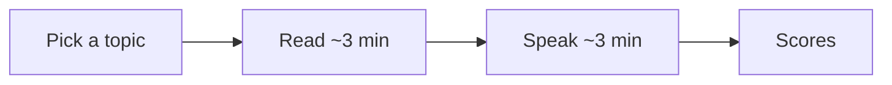

# Comprehendly

I kept doing the same thing. Read a long essay. Save it. Highlight a paragraph. Close the tab feeling like I got it.

Then someone would ask what the argument actually was, and I'd stall. I had the title. I didn't have the idea. A lot of "you know" and pieces of someone else's sentence.

That's why I built [Comprehendly](https://www.comprehendly.org/). I needed a way to check whether I understood something, not whether I had seen it before.

I'm [Himanshu Goswami](https://www.himanshugoswami.com/). This is a public product. What follows is current as of 13 September 2026. If this file and the live site disagree, trust the site.

The GitHub repo is still [Speaklikepro](https://github.com/hmmmmmanshu/Speaklikepro). Old name. The product is Comprehendly.

## The loop

Pick a topic. Read for about 3 minutes. Speak for about 3 minutes. Get scored on clarity, structure, depth, and original thought.



You choose something like philosophy, technology, film, science, startups, politics, psychology, or economics, then a tighter subtopic. You get a short essay. When you've had enough — or when the three minutes are up — the article leaves the screen. You talk from memory. No pause button. You can skip speaking, but then you don't get scored.

After that: an overall number, four scores with a note on each, a suggestion, your transcript, and sometimes a reflection question from the essay.

I am not scoring accent, charm, or how "confident" you sounded. I already knew I could sound fine and still be empty.

## Why the usual tools didn't help

Public speaking apps wanted better delivery. Flashcards wanted the right option. Read-later apps just made the unread pile bigger.

None of that was my problem. I could recognize a piece the second time I saw the headline. I could not hold it for three minutes in my own words.

This is that check. Read once. Close it. Speak. See where the thinking is thin.

## Scores

- **Clarity** — could a stranger follow the sentences
- **Structure** — a beginning, a middle, and a landing, or a pile of remarks
- **Depth** — did you work with the ideas, or just hover near them
- **Original thought** — a judgment, an example, a disagreement. Something of yours.

The transcript also gets compared with the article so parroting isn't treated as understanding. High overlap and no original thought is still a weak session.

## Stack

React, TypeScript, Vite, Tailwind. Supabase for the data. OpenAI for transcription and scoring. Keys stay in `.env` / `.env.local`. Don't commit them.

## Run it locally

```bash
git clone https://github.com/hmmmmmanshu/Speaklikepro.git
cd Speaklikepro
npm install
```

Put this in `.env` or `.env.local`:

```bash
VITE_SUPABASE_URL=your-supabase-url
VITE_SUPABASE_ANON_KEY=your-anon-key
```

Then:

```bash
npm run dev
```

`npm run build` and `npm test` work as usual. `npm run speakos:publish` can generate and upsert the essays; that path needs extra env vars and those should stay off git too.

Live site: [https://www.comprehendly.org/](https://www.comprehendly.org/)

The app says it at the end of a session: *Clarity is earned.*
