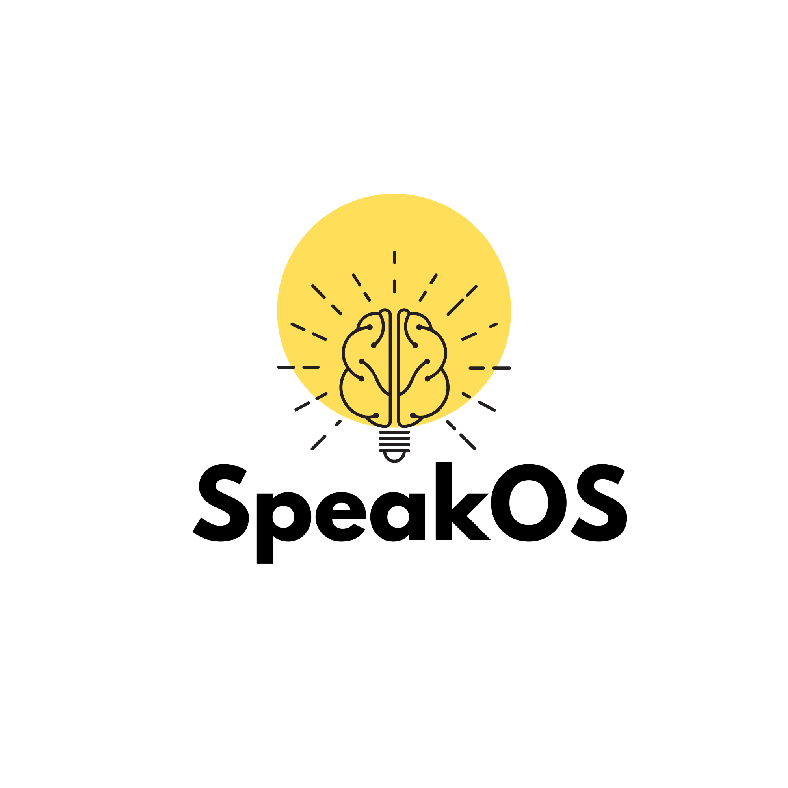
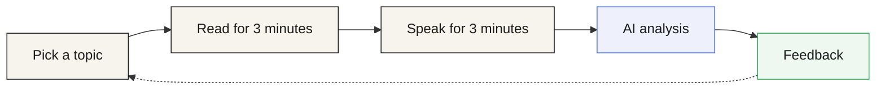
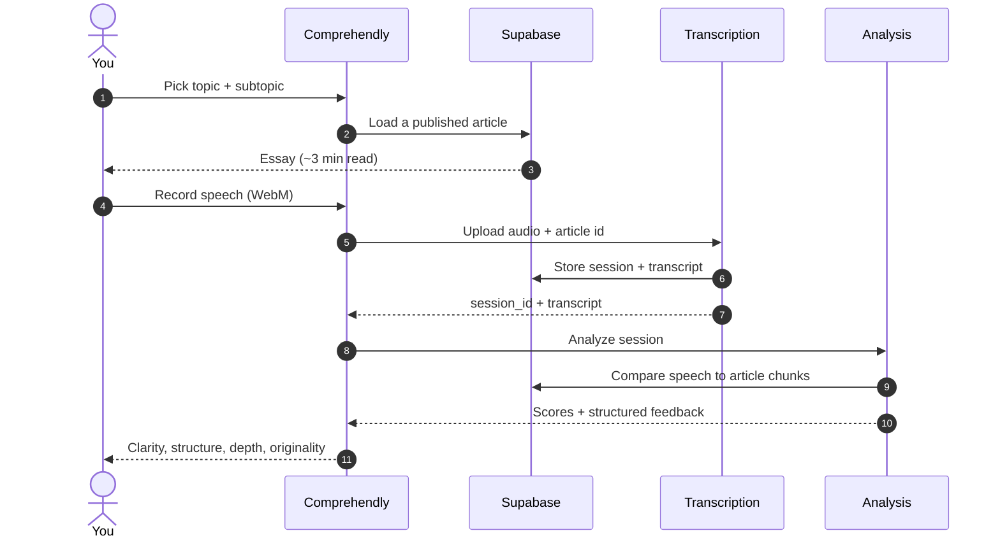

<p align="center">
  
</p>

<h1 align="center">Comprehendly</h1>

<p align="center">
  <strong>Read. Speak. Build depth.</strong><br />
  A public professional product for practicing clear thinking — not public speaking theatrics.
</p>

<p align="center">
  <a href="https://comprehending.org"></a>
  <a href="https://github.com/hmmmmmanshu/Speaklikepro"></a>
  <a href="#project-status"></a>
</p>

<p align="center">
  <a href="https://comprehending.org"><strong>https://comprehending.org</strong></a>
  ·
  Built by <a href="https://www.himanshugoswami.com/">Himanshu Goswami</a>
</p>

---

This repository is the **public, professional** source for [Comprehendly](https://comprehending.org).

This README is the current project description, written **13 September 2026**. It replaces older planning notes and earlier product names (SpeakOS / Speaklikepro). If something in this file and the running product disagree, the product at [comprehending.org](https://comprehending.org) is the source of truth.

---

## Why this exists

Most people consume more than they can explain.

We scroll, save, highlight, and binge essays. Recognition feels like learning: the next time a title appears, the brain says *I already know this*. Then someone asks a simple question — *what was the actual argument?* — and the answer collapses into fragments, borrowed phrases, and filler.

That gap is the product.

Comprehendly was built because **understanding is proven in speech**, not in bookmarks. If you cannot hold an idea for three minutes, in your own words, without the article in front of you, you did not finish thinking. You only finished reading.

Existing tools were a poor fit:

| What people reach for | What it actually trains |
| --- | --- |
| Public-speaking apps | Delivery: pace, filler words, gestures |
| Flashcards and quizzes | Recognition: can you pick the right option |
| Note-taking and read-later apps | Capture: more unread text |
| Generic AI chat | Fluency of the model, not of the user |

None of those force the hard loop: **read once, close the page, speak from memory, hear where your thinking is thin.**

The design bet is small and strict. Constraints create honesty. Three minutes of reading. Three minutes of speaking. Scores on clarity, structure, depth, and original thought — not on accent, charisma, or how “confident” you sounded.

The feeling we want after a session is not *I used an app*. It is *I actually thought about this.*

---

## What you do

A session is a single screen, one flow, no dashboard.



1. **Choose a topic** — Philosophy, technology, film, science, startups, politics, psychology, or economics, then a tighter subtopic.
2. **Read** — A short, structured essay (~3 minutes). The timer is a constraint, not a punishment. You can finish early when you have enough.
3. **Speak** — The article leaves the screen. You record up to 3 minutes from memory. No pause. You can skip, but you will not get scored feedback.
4. **Reflect** — Speech is transcribed, compared with the essay, and returned as scores plus written critique.

Clarity comes from articulation. Depth comes from having to reconstruct the idea, not reciting it.

---

## Who it is for

- Founders who need to explain a product without slides doing the thinking for them
- Students and researchers who must defend an idea, not only recognize it
- Writers and operators who want fewer shallow takes and more structured speech
- Anyone with a large reading list and a thin spoken vocabulary for the same subjects

It is **not** a pronunciation trainer, an English-learning app, or a debate club. Accent and occasional stumbles are irrelevant. Whether the thought holds together is not.

---

## How a session is scored

Scores are not random labels. Each one answers a different question:

| Dimension | What it asks |
| --- | --- |
| **Clarity** | Could a stranger follow the sentences? Minimal fog, filler, and muddle. |
| **Structure** | Did the talk have a beginning, a middle, and a landing — or a pile of remarks? |
| **Depth** | Did you work with the ideas, or only repeat nearby phrases? |
| **Original thought** | Did you add judgment, an example, a disagreement — something that is yours? |

An overall score sits on top of those four. Feedback includes a short summary, per-dimension reasoning, a concrete suggestion, your transcript, and (when present) a reflection question from the essay.

Under the hood, the spoken transcript is also compared to the article with embeddings. That similarity is a check on *coverage and paraphrase*, not a reward for reciting the source. High similarity with no original thought is still a shallow session.

---

## How the system works



**Frontend** — React, TypeScript, Vite, Tailwind. One route. Anonymous browser id; no login wall for the core loop.

**Backend** — Supabase. Curriculum lives in the `speakos` schema (`topics`, `subtopics`, `articles`, `article_chunks`). Sessions, transcripts, and analyses are persisted after a recording.

**AI**

- Speech-to-text via the `transcribe-audio` edge function (Whisper-class transcription)
- Structured scoring via `analyze-session`
- Embeddings (`text-embedding-3-small`, 1536 dimensions) to compare speech against article chunks

**Content** — Essays are written to a ~3-minute reading length (roughly 420–520 words), with a premise, key ideas, speaking anchors, and a reflection question. A publisher script (`npm run speakos:publish`) can generate and upsert that curriculum idempotently.

---

## Curriculum

Topics are built as a small library of serious, short essays — closer to a quiet magazine than a feed.

| Topic | Example subtopics |
| --- | --- |
| Philosophy | Thinking slowly, Stoicism, meaning, ethics |
| Technology | Good tools, AI, the internet, privacy |
| Films | Storytelling, directors, the art of cinema |
| Science | Doubt, physics, biology, climate |
| Startups | Patience and speed, building product, founders |
| Politics | Democracy, power, public discourse, citizenship |
| Psychology | The stories we tell, attention, habits |
| Economics | Prices, markets, inequality |

---

## Product principles

- **One sitting, one idea.** No maze of screens.
- **Quiet over loud.** White space, calm type, no streak counters in the core loop.
- **Expression as proof.** If it cannot be said, it is not finished.
- **Judgment over performance.** We score thinking, not theatre.
- **Honest constraints.** Three minutes is enough to reveal whether the idea is actually yours.

---

## Stack

| Layer | Choice |
| --- | --- |
| App | React 18, TypeScript, Vite |
| UI | Tailwind CSS, shadcn/ui |
| Data / auth-less sessions | Supabase (Postgres, Storage, Edge Functions) |
| Speech | Browser MediaRecorder → transcription function |
| Language + embeddings | OpenAI |
| Hosting | Production site: [comprehending.org](https://comprehending.org) |

---

## Run it locally

```bash
git clone https://github.com/hmmmmmanshu/Speaklikepro.git
cd Speaklikepro
npm install
```

Create a `.env` (or `.env.local`) with:

```bash
VITE_SUPABASE_URL=your-supabase-url
VITE_SUPABASE_ANON_KEY=your-anon-key
```

Then:

```bash
npm run dev
```

Useful scripts:

| Command | Purpose |
| --- | --- |
| `npm run dev` | Local Vite server |
| `npm run build` | Production build |
| `npm test` | Vitest |
| `npm run speakos:publish` | Generate / upsert curriculum (service role + OpenAI keys required) |

The publisher also needs `SUPABASE_URL`, `SUPABASE_SERVICE_ROLE_KEY`, and `OPENAI_API_KEY`. Never commit those.

---

## Repository layout

```text
src/
  pages/                 Single-flow app shell
  components/speakos/    Topic, reading, speaking, processing, feedback
  hooks/                 Content, recorder, session pipeline
  lib/                   Supabase client, anonymous id
scripts/speakos/         Curriculum taxonomy + publish agent
public/                  Brand mark
```

The GitHub repository is still named **Speaklikepro**. The product name is **Comprehendly**. That is historical, not a second product.

---

## Project status

| | |
| --- | --- |
| **Kind** | Public professional project |
| **Product** | Comprehendly |
| **Live site** | [https://comprehending.org](https://comprehending.org) |
| **Author** | [Himanshu Goswami](https://www.himanshugoswami.com/) |
| **This document** | 13 September 2026 |

This is not a private experiment and not a classroom sample. It is the public codebase for a shipped thinking tool.

Older internal definition files have been removed. Treat this README and the live site as the current description of the product.

---

<p align="center">
  <em>Clarity is earned.</em><br />
  <a href="https://comprehending.org">comprehending.org</a>
</p>
